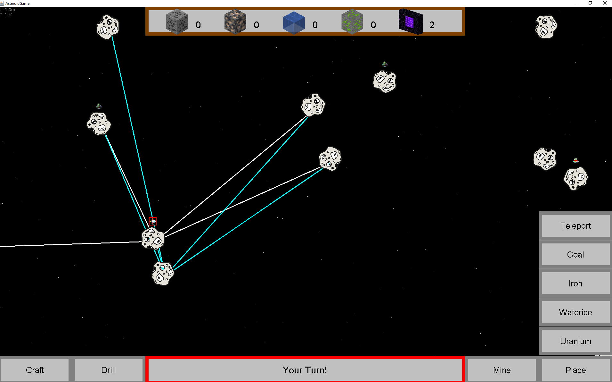
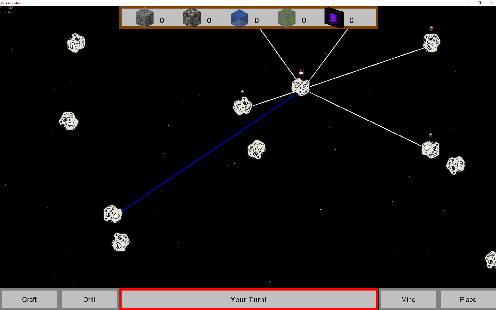

# Manuális tesztelés

Egy játéknál elengedhetelen a manuális tesztelés a maximális felhasználói élmény érdekében. Meg kell nézni, hogy valójában úgy működik a játék ahogy specifikálva van.

## Funkciók tesztelése

### Tesztek:

* [Infobox megjelenítése](#infobox-megjelentse)
* [Elérhető útvonalak megjelenítése](#elrhet-tvonalak-megjelentse)
* [Mozgás](#mozgs)
* [Fúrás](#frs)
* [Bányászás](#bnyszs)
* [Craftolás](#craftols)
* [Anyag visszahelyezése](#anyag-visszahelyezse)
* [Teleport elhelyezése](#teleport-elhelyezse)
* [Telepesek győznek](#telepesek-gyznek)

### Infobox megjelenítése
Ha rákattintunk egy tetszőleges aszteroidára megjelennek róla az információk olvashatóan és szépen. Jól látszik, ha még nincsenek kifúrva a rétegek nem látjuk az aszteroidában rejlő anyagot.

### Elérhető útvonalak megjelenítése
a) Arról az aszteroidáról amelyen tartózkodik az aktuális játékos fehér vonalak vezetnek a szomszédokhoz.

b) Arról az aszteroidáról amely fölé helyezzük az egeret kék vonalak jelennek meg a szomszédok irányába.

### Mozgás

Ha a soron következő játékossal kiválasztjuk az egyik szomszédos aszteroidát és a megjelenő infoboxon a move-ra nyomunk akkor a játékos animálva átmegy oda és a jobb felső sarokban is jelzi az elmozdulást.

### Fúrás

Ha a soron következő játékossal kiválasztjuk a drill funkciót akkor az adott aszteroidának a kérgén lefúrtunk egyet. Ennek a sikerességéről is kapunk visszajelzést és az infoboxon tudjuk ellenőrizni.

Fúrás előtt:

Fúrás közben:

Fúrás után:

### Bányászás

Ha a soron következő játékossal kiválasztjuk a mine funkciót akkor az adott játékos anyagai között megjelenik az új kibányászott anyag.

Bányászás előtt:

Bányászás után:

### Craftolás

a) Robot craftolás: Ha van megfelelő mennyiségű és típusú anyagunk akkor tudunk robotot craftolni. Erről is kapunk visszajelzést. Az inventoryból eltűnnek az anyagok és a robot és létre jön.

Előtte:

Utána:

b) Teleport craftolás: Ha van megfelelő mennyiségű és típusú anyagunk akkor tudunk teleportkapu párt craftolni. Erről is kapunk visszajelzést. Az inventoryból eltűnnek az anyagok és megjelenik a kapu.

Előtte:

Utána:

### Anyag visszahelyezése

Ha egy aszteroida üres és van anyagunk az inventoryba akkor vissza tudjuk helyezni.

Előtte:

Utána:

### Teleport elhelyezése

Lehelyezzük a teleportkapu párt két külön aszteroidán. Ekkor megnyílik sötétkéken egy útvonal a két aszteroida között.

Előtte:

Utána:

### Telepesek győznek

A kék, piros, sárga játékosoknak van minden anyagból egy-egy. Ha a sárgával belépünk, egy aszteroidán mindenből lesz 3, így nyernek a telepesek 

Előtte:

Utána:

